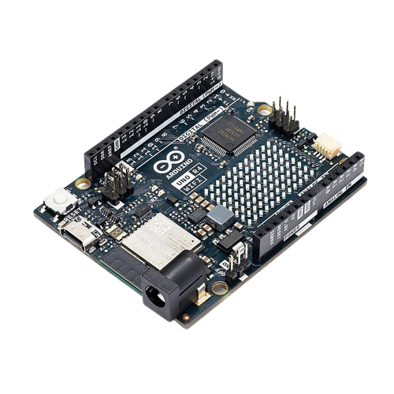
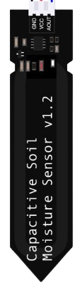
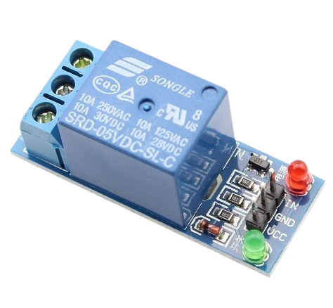
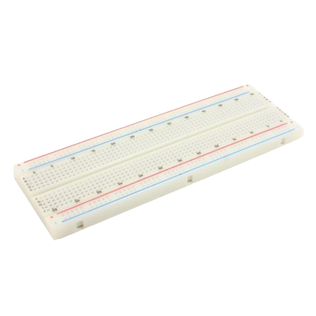
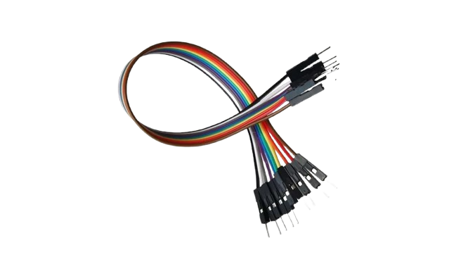
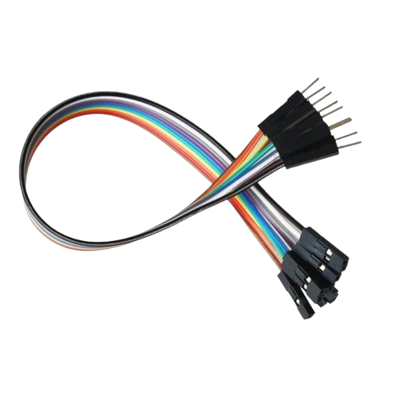
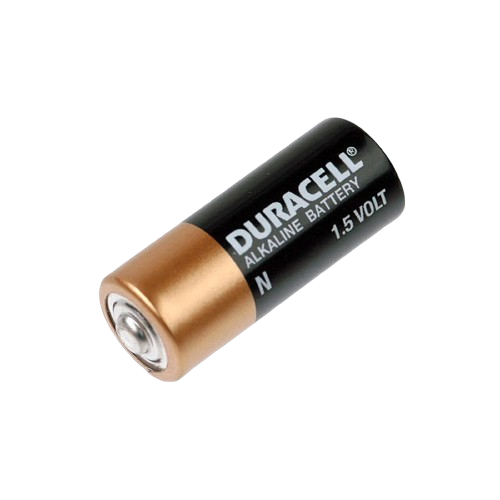
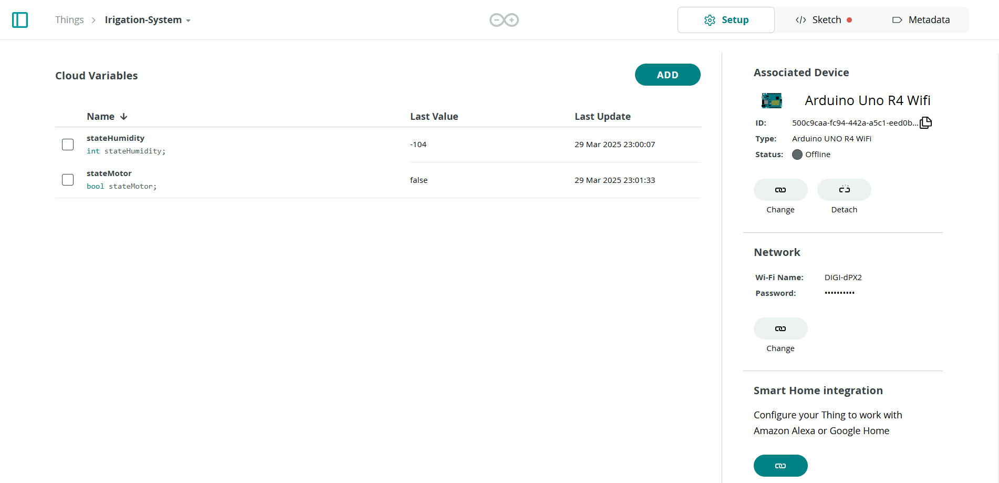
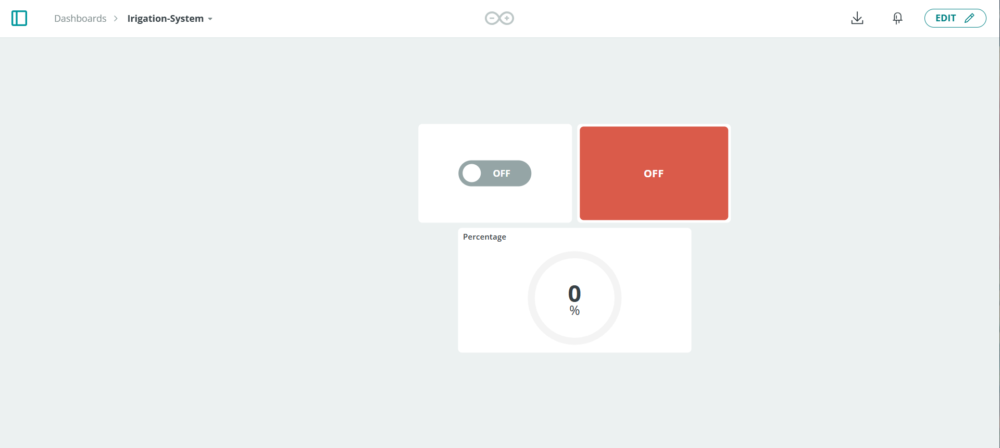
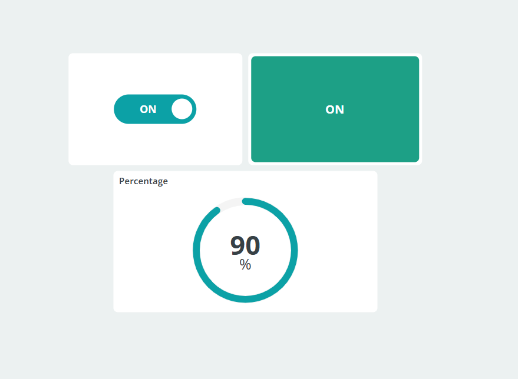

# 💧 Smart Irrigation System (Autonomous & IoT-Based)

Acest proiect propune două soluții pentru irigarea inteligentă a plantelor:
- 🔹 Un **sistem autonom**, complet automatizat
- 🔹 Un **sistem IoT**, controlabil și monitorizabil de la distanță prin **Arduino IoT Cloud**

---

## 🚀 Scopul Proiectului

- Automatizarea udării în funcție de umiditatea solului
- Economisirea apei
- Control local (autonom) sau remote (IoT)
- Monitorizare în timp real prin cloud *(versiunea IoT)*

---

## 🧩 Componente Necesare

| Componentă                       | Imagine                          | Descriere                           |
|----------------------------------|----------------------------------|-------------------------------------|
| Arduino Uno WiFi R4              | 

 | Microcontroller cu WiFi             |
| Senzor umiditate sol (capacitiv) | 

 | Citește nivelul de umiditate        |
| Modul releu 5V                   | 

           | Controlează pompa                   |
| Pompă apă DC 3V–5V (submersible) | 

      | Asigură irigarea                    |
| Breadboard                       | 

     | Conectare fără lipire               |
| Fire jumper M-M                  | 

 | Conectare fără lipire               |
| Fire jumper M-F                  | 

 | Conectare fără lipire               |
| Baterie / Sursă externă          | 

         | Alimentare pentru pompă             |

| Componente Extra                 | Imagine                          | Descriere                           |
|----------------------------------|----------------------------------|-------------------------------------|
| Arduino IDE                      | *(fără imagine)*                 | Software pentru programare Arduino  |
| Rezervor Apa                     |      | Recipient apă                       |
| Ghiveci (cu planta)              |              | Pentru testarea sistemului          |

---

## ⚙️ Funcționare Generală

1. Senzorul măsoară nivelul de umiditate.
2. Dacă este sub un prag definit (20%), se activează pompa.
3. Pompa se oprește automat când solul e suficient de umed.
4. În varianta IoT: valorile pot fi vizualizate și comanda pompa de la distanță.

---

## 🔧 Variantele Proiectului

### ✅ 1. Versiunea Autonomă

- Funcționează local, fără conexiune la internet
- Complet automat, fără intervenție umană
- Ideal pentru grădini mici sau sere

### 🌐 2. Versiunea IoT (Arduino Cloud)

- Poți vedea nivelul de umiditate în timp real din browser
- Controlezi pompa manual (ON/OFF) din cloud
- Necesită configurare pe [Arduino IoT Cloud](https://iot.arduino.cc)

#### Variabile în Arduino Cloud:

| Nume          | Tip     | Funcție                        |
|---------------|---------|--------------------------------|
| stateHumidity | Integer | Afișează nivelul de umiditate  |
| stateMotor    | Boolean | Comandă ON/OFF pentru pompă    |

---

## 🧠 Diagrame de Circuit

- **Circuit versiune autonomă**

- **Completare pentru versiune IoT**  

  
  
  

---

  
  

